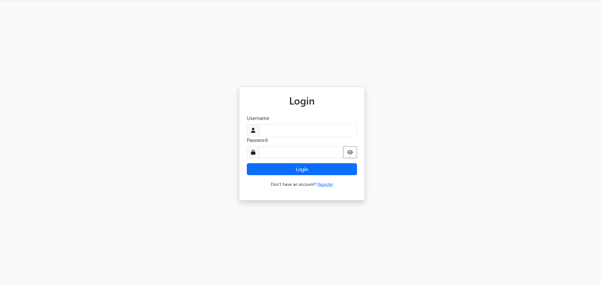
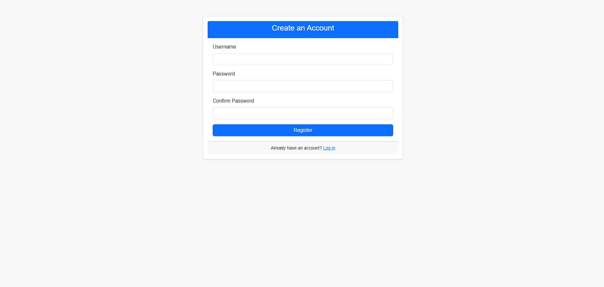
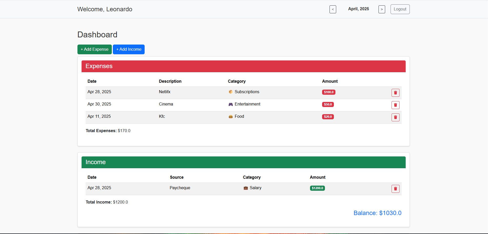
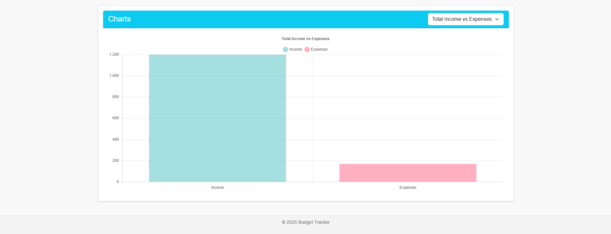

## 💰 Budget Tracker
An intuitive, personal finance tracker built with Flask to help you manage monthly income and expenses with visual charts and clean UI. This project was created as both a personal tool and a portfolio project to demonstrate full-stack development skills using Python, SQLAlchemy, HTML/CSS, and Chart.js.

## 🧬 Technology Stack
Frontend:

- HTML, CSS, Bootstrap ,Chart.js

Backend:

- Python (Flask), SQLAlchemy (ORM), SQLite

Other Tools:

- Jinja2 (Template Engine)
, Flask-Login (Authentication) , Werkzeug Security (Password Hashing) , python-dotenv (Environment Variables Management)

## 📄 Table of Contents

- Overview

- Features

- Architecture

- Getting Started

    - Local Setup

- Screenshots

- Future Improvements

- License

- Acknowledgments

## 📚 Overview

This is a full-stack Budget Tracker that allows authenticated users to:

- Add, view, and delete monthly expenses and incomes

- Visualize financial data through dynamic charts

- Toggle between income and expense categories using a dropdown menu

- Manage user sessions securely

Built from scratch using Flask and designed for personal use and as a portfolio piece.

## 🔍 Features

- ✅ User Authentication (Login/Register/Logout)

- 💸 Add/Edit/Delete Expenses and Incomes

- 🔄 Monthly Filters to view specific time periods

- 🌐 Responsive UI using Bootstrap

- 🌐 Dynamic Charts using Chart.js with:

- Income vs Expense comparison

- Income and Expenses per category

- Auto color mapping per category

- ✨ Flash messages and input validation

## 🏛 Architecture

```mermaidproject/
├── app/
│   ├── __init__.py
│   ├── auth.py
│   ├── models.py
│   ├── routes.py
│   ├── services.py
│   ├── static/
│   │   ├── flash.js
│   │   └── styles.css
│   └── templates/
│       ├── index.html
│       └── (other templates)
├── instance/
│   └── budget.db
├── app.py
├── README.md
├── .gitignore
├── requirements.txt
```
## 🚀 Getting Started

💻 Local Setup

1. Clone the repo
```bash
https://github.com/Wrub0002/BudgetManagerFlask.git
cd BudgetManagerFlask
```
2. Create a virtual environment and install dependencies:
```bash
python -m venv venv
# On Windows:
venv\Scripts\activate
# On Mac/Linux:
source venv/bin/activate
```
3. Install project dependencies
```bash
pip install -r requirements.txt
```
4. Create a .env file in the project root with the following content:
```bash
FLASK_APP=app.py
FLASK_ENV=development
SECRET_KEY=your_secret_key
SQLALCHEMY_DATABASE_URI=sqlite:///instance/budget.db
SQLALCHEMY_TRACK_MODIFICATIONS=False
```
5. Run the app
```bash
flask run
```
## 📸 Screenshots

1. Login page:

2. Register page:

3. Dashboard:




## 📆 License

This project is licensed under the MIT License.


